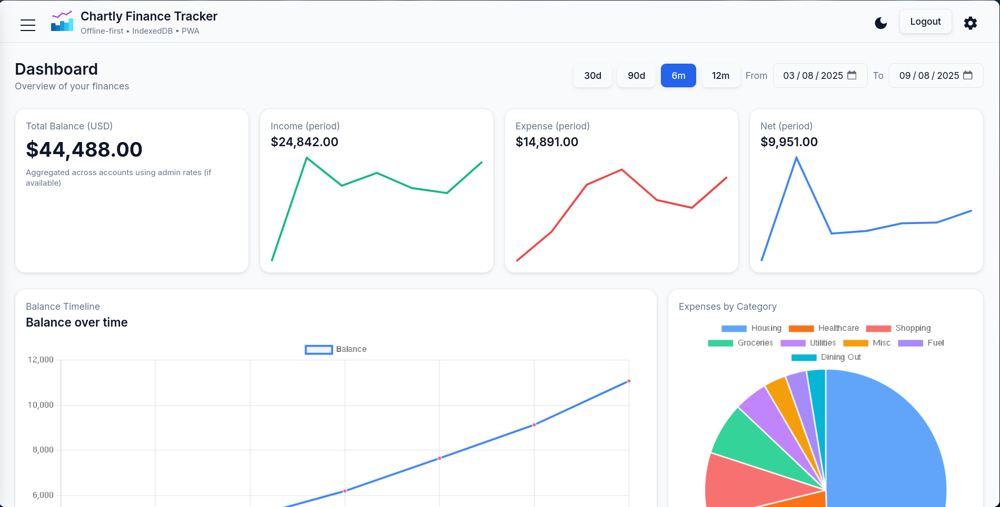
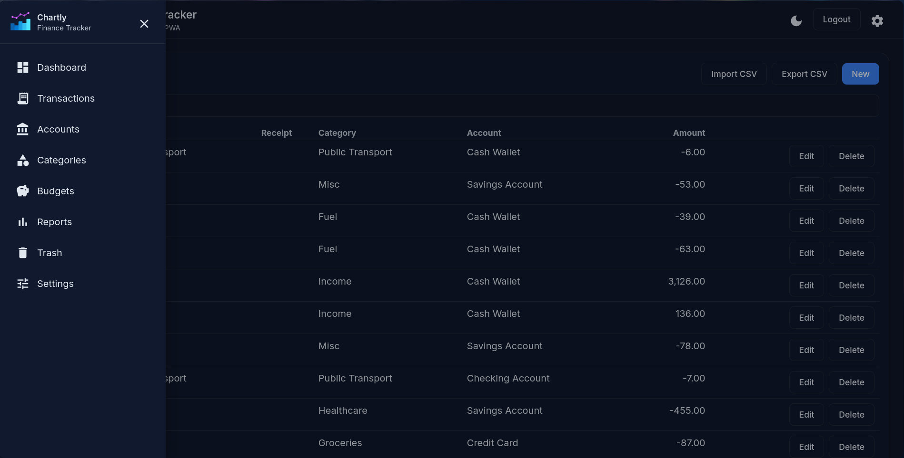

<p align="center">
  
</p>

<h1 align="center">Chartly Finance Tracker</h1>

## 

## Introduction

Chartly Finance Tracker is a modern, offline-first personal finance web application built with Angular, Tailwind CSS, and Angular Material. It is designed as a Progressive Web App (PWA) with local-first data persistence using IndexedDB (Dexie), enabling fast, private, offline-capable financial tracking with rich data visualizations.

This project was created to provide a lightweight, secure, and intuitive finance management experience that works reliably without a network connection while still supporting export/import and backup workflows for portability.

## Tech stack

- Framework: Angular (v20)
- UI: Tailwind CSS, Angular Material (CDK)
- Storage: IndexedDB (Dexie.js)
- Charts: Chart.js via ng2-charts
- PWA: Angular Service Worker
- Utilities: PapaParse (CSV), FileSaver
- Worker: Web Worker for heavy aggregation tasks
- Languages & Tooling: TypeScript, RxJS, PostCSS, Tailwind CLI

## Key Features

- Offline-first PWA with service worker for reliable use anywhere
- Local data storage using IndexedDB (Dexie) — transactions, accounts, categories, budgets, receipts
- Interactive dashboard with charts (balance timeline, income/expense, category breakdown)
- Full transactions management: create, edit, delete, attach receipt images
- Accounts and budgets management with editable modal dialogs
- Category/subcategory support with auto-tag rules
- CSV import/export and full JSON backup/restore
- Admin panel for seeding sample data and advanced maintenance
- Web Worker-powered aggregation for responsive UI on large datasets
- Responsive layout: mobile drawer, tablet/desktop sidebar, accessible controls

## Features — real usage examples

- Track everyday spending: create transactions for purchases, attach receipts; Chartly aggregates by category and shows trends on the dashboard.
- Monthly budgeting: add category budgets and get notifications when spending approaches thresholds.
- Reconcile accounts: add multiple accounts (checking, credit), view per-account balances and export histories to CSV.
- Offline-first flow: log expenses on the go; when online again, use the export/backup flow to move data to another device.

## Requirements

- Node.js 18+ and npm (or your preferred package manager)
- Modern browser with IndexedDB support (Chrome, Edge, Firefox, Safari mobile/desktop)

## Setup & Development

```bash
# 1. Clone the repository

git clone https://github.com/7amo10/chartly-finance-tracker.git
cd fusion-angular-tailwind-starter

# 2. Install dependencies

npm install

# 3. Run development server

npm start, ng serve

# 4. Open the app

Visit http://localhost:4200 (or the URL provided by your dev environment)

# 5. Build for production

npm run build

```

> [!NOTE]
>
> - While developing, if the service worker caches assets or data, use the Admin > Clear Cache action to unregister service workers and clear caches.
> - The app includes example seed data via the Admin panel to populate accounts, categories, and sample transactions for demo purposes.

## Project structure (quick)

## 

- src/app — application code (pages, components, services)
- src/app/data — Dexie DB and models
- src/app/pages — feature pages (dashboard, transactions, accounts, categories, budgets, admin)
- src/app/components — smaller UI components (banners, toasts)
- src/app/workers — web worker implementations for aggregation
- src/styles.css — Tailwind + custom CSS layers

## Contributing & Best Practices

- Follow Angular style and use standalone components where possible
- Keep heavy computations in web workers to avoid blocking the UI
- Prefer small, testable services for data access (DataService) and single-responsibility components
- When updating UI assets (logo), use a lightweight PNG/SVG optimized for web (96x96 for header)

## Conclusion

Chartly Finance Tracker aims to be a fast, private, and resilient personal finance tool that works across devices and network conditions. Its local-first design, combined with a modern Angular + Tailwind UI, makes it ideal for users who value privacy, speed, and offline reliability.

---

Maintainers: Project workspace
